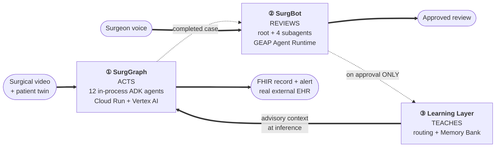

<div align="center">

# SurgOS: Autonomous, Continuously Improving Surgical Safety System

**SurgOS watches a robotic surgery in real time, catches technique errors as they happen, reasons about where they lead using live published literature, and writes a real clinical record - then reviews the case with the surgeon by voice/text and carries their feedback to improve next sessions.**

[](https://cloud.google.com/vertex-ai)
[](https://developers.google.com/health-ai-developer-foundations)
[](https://developers.google.com/health-ai-developer-foundations)
[](https://google.github.io/adk-docs/)
[](https://cloud.google.com/vertex-ai)
[](https://cloud.google.com/run)
[](https://cloud.google.com/firestore)
[](https://cloud.google.com/security-command-center/docs/model-armor-overview)
[](https://hapi.fhir.org)
[](https://www.python.org/)
[](#6-spin-up-instructions)

**Built for:** [All Things Agentic Hackathon](https://allthingsagentichackathon.devpost.com/) · Taskmaster track

**Live Demo:** _(demo video - add URL)_

**Live Deployment:** https://surggraph-frontend-518946358970.us-central1.run.app

</div>

---

## Table of Contents

1. [The Problem](#1-the-problem)
2. [The Solution: What SurgOS Does](#2-the-solution-what-surgos-does)
3. [Architecture](#3-architecture)
4. [How It Works](#4-how-it-works)
5. [Google Cloud Services](#5-google-cloud-services)
6. [Spin-Up Instructions](#6-spin-up-instructions)
7. [Project Structure](#7-project-structure)
8. [Data Sources](#8-data-sources)
9. [Disclaimer](#9-disclaimer)
10. [Attributions](#10-attributions)

---

## 1. The Problem

**Surgical errors compound into complications.**

**Complications impact patient outcomes.** 

**Avg. Surgical documentation falls days behind the case that needed it.**

**And feedback from one case rarely reaches the next.**

Real example: In a [case published in 2023](https://pmc.ncbi.nlm.nih.gov/articles/PMC10436752/), a stitching needle slipped out of view during a robotic prostate operation and was lost inside the patient. Finding it meant stopping to search and X-ray - and [X-rays miss needles under 10 mm about 70% of the time](https://pmc.ncbi.nlm.nih.gov/articles/PMC10436752/). Leaving one behind is what hospitals call a *never event*: roughly [1 in 10,000 operations](https://pmc.ncbi.nlm.nih.gov/articles/PMC12768046/), at an average cost of [about $166,000](https://www.aorn.org/outpatient-surgery/article/the-high-cost-of-retained-surgical-items) each time.

**The needle was on camera the whole time it went missing.** Nobody was watching that feed, nothing reasoned about where it had gone, the operative note was written weeks later, and none of it reached the next case.

| The problem | Impact |
|---|---|
| **26.4% of patients** who have something go wrong during an operation go on to develop a serious complication - against 12% of patients where nothing does. One missed step rarely stays contained. <br>[Gawria et al., 2023](https://pmc.ncbi.nlm.nih.gov/articles/PMC10095268/) | Longer stays, repeat surgery |
| **15% of surgery patients** develop at least one complication, and 6% develop more than one. Not an edge case - the baseline risk of operating. <br>[Tevis et al., 2016](https://pmc.ncbi.nlm.nih.gov/articles/PMC6214627/) | Never events cost ~$166,000 |
| **374 hours - over 15 days** is how long the average operating note takes to be written up and signed off. The record everyone else relies on is routinely two weeks stale. <br>[Laflamme et al., 2005](https://pmc.ncbi.nlm.nih.gov/articles/PMC1560865/) | Hours of delay, Follow-up care flies blind |
| **Only 28% of feedback programmes** for clinicians improve care by 10% or more; across 98 trials the typical gain was 4.4 points. What one team learns rarely reaches the next. <br>[Ivers et al., 2014](https://pmc.ncbi.nlm.nih.gov/articles/PMC4238192/) | Same mistake, next patient |

>**The operating room generates the richest signals in medicine and most of it is never fully leveraged - in the moment, in the record, and in the loop back to the next case.**

---

## 2. The Solution: What SurgOS Does

| Feature | Impact |
|---|---|
| **Watches the surgery** - Gemini 3.5 vision over 5-second windows | Continuously updated case context - each instrument movement, interaction with anatomy, phase - automatically logged. **107 nodes / 144 edges from a 90-second window, with nobody watching.** |
| **Autonomously detects technique errors** - 3 independent agents (temporal, spatial, procedural) vote; deterministic aggregation decides | Errors surface **in the window instant they occur**, _not in a chart review weeks later_. |
| **Reasons about downstream complications** - patient-specific, grounded in literature retrieved at call time | Tells the surgeon **where the error is likely to lead for *this* patient at _this_ instant** - their BMI, ASA class, prostate anatomy - backed by the medical literature search, rather than a generic risk score. |
| **Proposes a corrective plan** - from a bounded, OCHRA-derived action library, never free-form clinical text | Suggests **actionable next step to avoid the complication.** And when the system isn't confident, it says *"Escalate - no confident corrective match"* rather than sending a surgeon down a plan it can't stand behind. |
| **Watches the trajectory and alerts on divergence** - deterministic graph check first, LLM only if ambiguous | **Silence when the plan is followed.** Alarm fatigue is designed out: the system only speaks when the case actually diverges from the safer path. |
| **Generates the full operative record in minutes** - drafted by MedGemma 4B, a medical-domain model | **Reduces the avg wait time from 374 hours to ~4 minutes.** The record is accurate because it's assembled from what was *observed*, not recalled two weeks later - and the whole care team gets it while it still matters. |
| **Writes divergences and documentation to a real FHIR endpoint** | Findings land **where the rest of the care team already looks**. Every write is read back to confirm it arrived. |
| **Refuses to write what it can't evidence** - a fail-closed gate, deliberately not an LLM | A surgeon can trust an alert because the system is **structurally unable to raise errir without evidence.** Blocked writes stay visible on the graph, so what *didn't* go out is auditable too. |
| **Screens every input and output** - Model Armor, one template, both directions | A hostile or malformed instruction **never reaches the model**, and nothing unsafe reaches the record - protecting both the patient's data and the integrity of what gets filed under a surgeon's name. |
| **Keeps a human on every external write** - 3 human-in-the-loop gates | **No autonomous action ever reaches a patient's chart.** The surgeon stays the decision-maker; the system does the work and waits to be told yes. |
| **Lets surgeons and safety teams review the case by voice** - SurgBot's 6-phase conversational review | Patient-safety review in **minutes, hands-free, without opening a chart** - across one case or all of them. Real cross-case analysis over **103 cases** surfaced "out of view" (174) and "needle handling" (117) as the dominant failure modes. |
| **Learns from what the surgeon says** - approved feedback routed to the specific agent it belongs to | Feedback given **once** changes every future case automatically. The median clinician-feedback intervention moves quality 4.4 points because it never propagates; here propagation is the only thing an approval does. |

---

## 3. Architecture

[](docs/architecture/surgos-architecture-diagram-4k.png)

> **[Open the full-resolution diagram →](docs/architecture/surgos-architecture-diagram-4k.png)** · [SVG source](docs/architecture/surgos-architecture-diagram.svg)

Two workflows on two runtimes, sharing one state layer and one governance layer.

- **SurgGraph** runs **12 in-process ADK agents on Cloud Run + Vertex AI.** The sweeps make tight, high-volume calls per window; the in-process event bus invariant breaks the moment a case's agents are split across processes; and the vision agents read frames straight off local disk. Remote hops would cost more than they'd buy.
- **SurgBot** runs **5 separately deployed reasoning engines on the Gemini Enterprise Agent Platform** - Agent Runtime for the engines, Agent Registry for discovery, Agent Identity (SPIFFE) on the tool-free subagents, and Memory Bank as the substrate of the learning layer. Low call volume, managed sessions, native cross-session memory.

SurgBot being on Agent Runtime is what makes the SurgGraph placement a **measured choice rather than an inability**. Both Cloud Run services are registered in Agent Registry regardless.

### The Living Graph

There is no `CaseState` object passed between agents. **State lives entirely in one shared, typed graph in Firestore**, and every agent reads and writes it through a single mutation API.

- **20 node types, 13 edge kinds** - from `entity` and `phase` through `error`, `complication`, `literature_evidence`, `corrective_trajectory`, `divergence_alert`, `verification_block` and `documentation`.
- **One Firestore document per case** holds a monotonic `seq`; every write is a real transaction, so concurrent writers serialize instead of racing. One isolated graph per case.
- **Real-time fan-out** via Firestore `on_snapshot`, scoped to `seq > baseline` captured *before* the listener attaches - closing a real data-loss window between a client's snapshot read and its stream open. The console renders live over SSE with no polling.
- **Node IDs come from one module** (`state/node_ids.py`), never hand-formatted by an agent - which is what stops edges from silently dangling when two agents disagree on a convention.
- **Removals are overwrites, not deletes** - a deleted document leaves a listener nothing to reconstruct the event from.

### The deterministic / LLM boundary

**An LLM reasons over evidence. It never does arithmetic, never gates safety, never receives the answer key.**

The verification gate, weighted aggregation, severity scoring, literature rank fusion, alert routing, the first-pass divergence check and the entire perception change-diff layer are plain Python on purpose. **Every safety property in this system comes from a step a model is not allowed to touch.**

Full internals - every agent, every prompt, every write path, file-by-file - are in **[docs/surggraph_internals.md](docs/surggraph_internals.md)**.

---

## 4. How It Works

SurgOS is one system running two workflows, joined by a learning layer.



**① SurgGraph - the autonomous workflow.** Point it at a case and press play. `POST /cases/open` mints an isolated `case_id`, writes the full static agent topology up front, and runs perception and error detection as two concurrent sweeps over 5-second windows. Everything downstream is **event-driven, not scheduled** - each stage wakes only when a specific node type lands on the graph. It ends with a real external clinical write and a drafted operative record sitting in a human approval queue.

**② SurgBot - the conversational feedback workflow.** After the case, a surgeon or patient-safety reviewer talks it through by voice. SurgBot never touches the pipeline - it only *reads* the graph SurgGraph already produced. Six phases: case framing, phase walkthrough, error-and-complication review, proposal/divergence review, synthesis, and cross-session patterns - plus standing cross-case queries at any point.

**③ The learning layer - what closes the circuit.** On approval only, feedback is classified (a standing directive, or a case-grounded observation), screened by Model Armor, written to Firestore as the system of record, and indexed into Memory Bank scoped by target agent. Literature retrieval, complication reasoning, corrective replanning and divergence detection each pull their own slice at inference time. It is **advisory text only** - explicitly marked *"NOT ground truth"*, forbidden from suppressing findings, and structurally unable to touch the verification gate.

### Agent roster

| Component | Layer | What it does |
|---|---|---|
| **Orchestrator** | SurgGraph | Opens the case, writes the entire agent topology before anything runs, subscribes the event-driven agents, drives the two sweeps. A plain async function, not an LLM decision-maker. |
| **Perception** | SurgGraph | One Gemini 3.5 vision call per 5-second window. Raw output never reaches the graph directly - a deterministic change-diff layer with entity/relation/activity debounce decides what gets promoted, so steady state emits nothing. |
| **Error Detection - Temporal** | SurgGraph | Motion across the window: hesitation, retries, multi-attempt patterns. |
| **Error Detection - Spatial** | SurgGraph | Instrument and anatomical positioning at native resolution - what left the field of view. |
| **Error Detection - Procedural** | SurgGraph | Observed technique vs. expected protocol, against six OCHRA-derived error categories. |
| **Weighted Aggregation + Severity** | SurgGraph · *deterministic* | Requires ≥2-of-3 role agreement and a composite score above threshold to raise an error, then scores severity. **No model** - consensus arithmetic isn't a thing an LLM should do. |
| **Complication Reasoning** | SurgGraph | Event-driven off error nodes above a severity threshold. Formulates a literature query from live case context and writes complications linked back to their evidence, with rationale specific to *this* patient. |
| **Literature Retrieval** | SurgGraph · *tool* | Europe PMC, PubMed E-utilities and Semantic Scholar queried in parallel, merged by reciprocal rank fusion with DOI dedup. Every citation traces to a real query. |
| **Corrective Replanning** | SurgGraph | Selects from a bounded, pre-authored action library derived from OCHRA's own normal-technique indicators, or escalates when nothing fits. Never invents a novel procedure. |
| **Proposal Acknowledgment** | SurgGraph · *HITL* | The surgeon acknowledges or dismisses a live proposal. The decision is durable graph state, so it survives a restart. |
| **Divergence Detection** | SurgGraph | Polls only while a proposal is live. Deterministic graph check first; LLM reasoning only when that's ambiguous. Writes nothing when the plan is followed. |
| **Alert Routing** | SurgGraph · *deterministic* | Writes the pending action to the graph *before* sending it, calls the gate synchronously, executes only on a pass - so a blocked alert leaves a visible record of what didn't go out. |
| **Verification Gate** | SurgGraph · *deterministic* | Eleven structural checks over the graph, fail-closed. Read-only **by import**, not by promise: it cannot write the action it approves. |
| **Documentation** | SurgGraph | Drafts the operative record on **MedGemma 4B**, with no general-model fallback. Screened by Model Armor before a surgeon sees an Approve button. |
| **Operative Record Approval** | SurgGraph · *HITL* | Approve, edit or reject. An edit is re-screened and re-gated before filing - human input is treated as untrusted, exactly like model output. |
| **FHIR Write Executors** | SurgGraph · *tool* | Thin adapters. Real `Communication` and `DocumentReference` writes, each read back to confirm. |
| **SurgBot Orchestrator** | SurgBot | The one agent the surgeon talks to. Nine real tools driving the six-phase review. **The only agent in the system with tools**, because a live conversation's next question can't be pre-sliced. |
| **Error Chain Reviewer** | SurgBot | Explains the mechanism behind a flagged error and probes whether it holds up clinically. Separately deployed with Agent Identity. |
| **Synthesis** | SurgBot | Drafts the case review document from what the surgeon actually said. |
| **Pattern Insight** | SurgBot | Surfaces patterns across a reviewer's prior sessions from Memory Bank. Reports "no history yet" honestly rather than inventing one. |
| **Feedback Router** | SurgBot | Classifies free-text feedback as a standing directive or a case-grounded observation, and routes it to the pipeline agent it belongs to. |
| **Review Approval** | SurgBot · *HITL* | Approving the review is what turns captured feedback into durable knowledge. |
| **MedASR / Chirp 3 HD** | SurgBot · *tool* | Medical-domain speech recognition in, streaming HD synthesis out. Disclosed in the transcript as plain API calls, not dressed up as agents. |

---

## 5. Google Cloud Services

| Category | Services |
|---|---|
| **AI models** | **Gemini 3.5 Flash** (Vertex AI, `global` endpoint) · **MedGemma 4B** (self-deployed Vertex AI endpoint) · **MedASR** (self-deployed Conformer ASR) · **Chirp 3 HD** (Cloud Text-to-Speech) |
| **Agent platform** | **Vertex AI** · **Gemini Enterprise Agent Platform** - Agent Runtime (5 engines) · Agent Registry (6 services) · Agent Identity (SPIFFE) · Memory Bank · **Model Armor** |
| **Infrastructure** | **Cloud Run** (4 services) · **Cloud Build** (CI/CD on push to main) · **Firestore** (Living Graph) · **Cloud Storage** · **Artifact Registry** |
| **Observability** | **Cloud Trace** (OpenTelemetry GenAI spans) · **Cloud Logging** · **Cloud Monitoring** |

---

## 6. Spin-Up Instructions

### Prerequisites

- **Python 3.12** (`>=3.12,<3.13`) and [`uv`](https://docs.astral.sh/uv/)
- **Node.js 20+** and npm
- A **Google Cloud project** with billing enabled
- `gcloud` CLI, authenticated: `gcloud auth login && gcloud auth application-default login`

### Step 1 - Clone and install

```bash
git clone https://github.com/adityashukla8/surggraph.git
cd surggraph

uv sync                              # Python dependencies
cd ui/frontend && npm ci && cd ../..  # frontend dependencies
```

### Step 2 - Enable Google Cloud APIs

```bash
export PROJECT_ID=your-project-id
gcloud config set project $PROJECT_ID

gcloud services enable \
  aiplatform.googleapis.com \
  run.googleapis.com \
  cloudbuild.googleapis.com \
  artifactregistry.googleapis.com \
  firestore.googleapis.com \
  storage.googleapis.com \
  modelarmor.googleapis.com \
  speech.googleapis.com \
  texttospeech.googleapis.com \
  cloudtrace.googleapis.com
```

### Step 3 - Create the backing resources

```bash
# Firestore (native mode) - the Living State Graph
gcloud firestore databases create --location=us-central1

# Cloud Storage - source video, annotations, build artifacts
gcloud storage buckets create gs://surggraph-cases-$PROJECT_ID --location=us-central1

# Model Armor template - screens both inbound turns and outbound generated content
gcloud model-armor templates create surggraph-fhir-outbound --location=us-central1
```

### Step 4 - Download the dataset

The video and annotations are **not** in this repository - they are ~890MB of licensed research media. **See [`data/README.md`](data/README.md) for the full walkthrough**; UCL's repository sits behind a WAF challenge that blocks scripted downloads, so these must be fetched through a browser.

```
data/video/video_01/          # SAR-RARP50 video file
data/annotations/video_01/    # action_discrete.txt, segmentation/, error_annotation.pkl
```

Then verify what you have:

```bash
uv run scripts/validate_downloaded_data.py video_01
```

### Step 5 - Configure the environment

```bash
cp .env.example .env
```

Key variables:

| Variable | Used by | Purpose |
|---|---|---|
| `SURGGRAPH_PROJECT_ID` | `tools/gemini_model.py` | GCP project for Vertex AI |
| `SURGGRAPH_REGION` | everywhere | Default `us-central1` |
| `GEMINI_MODEL` | `tools/gemini_model.py` | Default `gemini-3.5-flash` |
| `GEMINI_LOCATION` | `tools/gemini_model.py` | Default `global` - the model 404s on every tested regional endpoint |
| `GOOGLE_GENAI_USE_VERTEXAI` | `google-genai` | `true` - route through Vertex AI, not the Gemini API |
| `FIRESTORE_DATABASE` | both services | Named Firestore database, default `(default)` |
| `SURGGRAPH_GCS_BUCKET` | state service | Video and annotation storage |
| `FHIR_BASE_URL` | `tools/fhir_write.py`, `tools/fhir_alert.py` | Default `https://hapi.fhir.org/baseR4` |
| `STATE_SERVICE_URL` | `tools/state_tools.py` | If unset, agents fall back to local JSONL (scripts/tests only) |
| `SURGGRAPH_MODEL_ARMOR_TEMPLATE_ID` | `tools/model_armor.py` | Model Armor template ID |
| `MEDGEMMA_ENDPOINT_ID` | `tools/medgemma_model.py` | Vertex AI endpoint for the documentation model |
| `MEDASR_ENDPOINT_ID` | `agents/surgbot/speech.py` | Vertex AI endpoint for medical speech-to-text |
| `SURGBOT_ROOT_AGENT_RESOURCE` | `services/surgbot_service` | Deployed Agent Runtime reasoning engine |
| `SURGGRAPH_FEEDBACK_KB_ENGINE` | `tools/feedback_kb.py` | Memory Bank engine backing the learning layer |
| `SURGGRAPH_SWEEP_START_S` / `_END_S` | `tools/video_utils.py` | Optional dev bound on how much video a case sweeps |
| `SURGGRAPH_ENABLE_CLOUD_TELEMETRY` | `tools/observability.py` | OpenTelemetry export to Cloud Trace |
| `VITE_STATE_SERVICE_URL` / `VITE_ORCHESTRATOR_URL` / `VITE_SURGBOT_SERVICE_URL` | frontend | Backend URLs, inlined at **build** time |

### Step 6 - Deploy the model endpoints

MedGemma and MedASR are self-deployed from Model Garden. Both are GPU-backed and billed hourly while running.

```bash
# MedGemma 4B - g2-standard-24 + 2x NVIDIA L4
# MedASR      - n1-standard-8  + 1x NVIDIA T4
```

Deploy both via Model Garden, then set `MEDGEMMA_ENDPOINT_ID` and `MEDASR_ENDPOINT_ID` in `.env`. See [`docs/qa_log.md`](docs/qa_log.md) for the real deploy configurations, measured cold-start behaviour and cost figures.

### Step 7 - Run locally

Four processes, four ports:

```bash
# terminal 1 - state service (single writer of the Living Graph)
uv run uvicorn services.state_service.main:app --host 127.0.0.1 --port 8080

# terminal 2 - orchestrator (runs the whole SurgGraph pipeline)
uv run uvicorn services.orchestrator_service.main:app --host 127.0.0.1 --port 8090

# terminal 3 - SurgBot relay (WebSocket, voice + text)
uv run uvicorn services.surgbot_service.main:app --host 127.0.0.1 --port 8091

# terminal 4 - frontend
cd ui/frontend && npm run dev
```

Open **http://127.0.0.1:5173**, press play on the demo video, and watch the graph build live.

### Step 8 - Deploy SurgBot to Agent Runtime

The five SurgBot reasoning engines are deployed separately from the Cloud Run services:

```bash
uv run scripts/deploy_surgbot_subagents.py   # the 4 subagents, with Agent Identity
uv run scripts/deploy_surgbot_agent.py       # the root agent
uv run scripts/register_surgbot_agents.py    # register all of them in Agent Registry
```

> A code change inside `agents/surgbot/` does **nothing** in production until the agent is redeployed - the fix landing in git is not the fix landing in the running system. Both deploy scripts pin `google-adk` and `google-genai` explicitly, after an unpinned transitive upgrade broke a redeploy.

### Step 9 - Deploy to Google Cloud

One Cloud Build pipeline builds and deploys all four Cloud Run services:

```bash
gcloud builds submit --config cloudbuild.yaml
```

Or wire it to a GitHub trigger for deploy-on-push-to-main.

**Two things the pipeline does that are easy to miss:**

1. **It pulls the dataset media from Cloud Storage before building.** GitHub doesn't have `data/video/` or `data/annotations/` (both gitignored), but the vision agents read frames straight off local disk with no GCS fallback. Without steps 0 and 1 the image builds and deploys perfectly cleanly, then fails *every* case. Upload your media once: `gcloud storage cp -r data/video/video_01 gs://surggraph-cases-$PROJECT_ID/videos/`.
2. **It deliberately passes no env vars on deploy.** Cloud Run inherits the previous revision's config when deploying with `--image` alone. Several vars were set by hand and aren't derivable from the repo - passing them here would silently wipe them.

### Step 10 - Verify

```bash
uv run pytest tests/ -q                          # 159 tests
cd ui/frontend && npx tsc -b                     # NOT --noEmit - see docs/qa_log.md #5
uv run scripts/validate_graph_chain.py <case_id> # dangling / orphans / reachability
```

The graph-chain validator is the important one. Firestore has no foreign-key enforcement and the renderer drops a dangling edge without a word, so a case can be badly broken while every write succeeded and every count looks right. **Three separate defects were found by this validator and by nothing else.**

---

## 7. Project Structure

```
surggraph/
├── agents/                      # every agent, one module each
│   ├── orchestrator/            #   opens a case, wires and drives the pipeline
│   ├── perception/              #   vision sweep + deterministic change-diff layer
│   ├── error_detection/         #   3 role subagents, aggregation, severity, knowledge base
│   ├── complication_reasoning/  #   error → patient-specific complication
│   ├── literature_retrieval/    #   3-API fan-out + reciprocal rank fusion
│   ├── corrective_replanning/   #   bounded action library selection
│   ├── divergence_detection/    #   actual vs. proposed trajectory
│   ├── alert_routing/           #   intent-before-write, gate-checked delivery
│   ├── verification_gate/       #   fail-closed, read-only by import, no LLM
│   ├── documentation/           #   MedGemma operative record draft
│   ├── hitl/                    #   acknowledgment + approval state transitions
│   └── surgbot/                 #   root agent, 4 subagents, tools, speech, Memory Bank
│
├── services/                    # three FastAPI apps, one shared image
│   ├── state_service/           #   single writer of the Living Graph + SSE fan-out
│   ├── orchestrator_service/    #   POST /cases/open, HITL endpoints
│   └── surgbot_service/         #   WebSocket relay: STT → agent → TTS
│
├── state/                       # the state layer itself
│   ├── schema.py                #   20 node types, 13 edge kinds, provenance
│   ├── node_ids.py              #   the single source of every node/edge ID
│   └── event_bus.py             #   in-process pub/sub driving the event-driven agents
│
├── tools/                       # capabilities, not agents
│   ├── gemini_model.py          #   global-endpoint Gemini wrapper
│   ├── medgemma_model.py        #   MedGemma endpoint client
│   ├── state_tools.py           #   the single graph write path
│   ├── context_slice.py         #   deterministic per-agent graph slicing
│   ├── model_armor.py           #   inbound + outbound screening
│   ├── fhir_write.py / fhir_alert.py   # real external writes, readback-verified
│   ├── europepmc_rag.py / pubmed_eutils.py / semantic_scholar_api.py
│   ├── feedback_kb.py           #   the learning layer's retrieval side
│   └── memory_bank.py           #   GEAP Memory Bank client
│
├── ui/frontend/                 # React + Vite + TypeScript
│   └── src/
│       ├── pages/home/          #   the landing site
│       ├── graph/               #   live ReactFlow graph over SSE
│       ├── surgbot/             #   voice panel, WebSocket client
│       └── video/               #   player + case trigger
│
├── data/                        # datasets (media gitignored - see data/README.md)
├── docs/                        # architecture diagram, internals, QA log, validation
├── scripts/                     # deploy, validate, benchmark, E2E test drivers
├── tests/                       # 159 tests, real-data assertions throughout
├── cloudbuild.yaml              # CI/CD: 4 Cloud Run services on push to main
└── Dockerfile                   # one shared backend image, SERVICE_MODULE selects the app
```

---

## 8. Data Sources

| Source | Role | Note |
|---|---|---|
| **[SAR-RARP50](https://rdr.ucl.ac.uk/projects/SAR-RARP50_Segmentation_of_surgical_instrumentation_and_Action_Recognition_on_Robot-Assisted_Radical_Prostatectomy_Challenge/191091)** | Real robot-assisted radical prostatectomy video with per-frame action and instrument-segmentation annotations | One video used end to end. Action IDs reach the perception agent as **opaque numeric hints only** - never a name, never fed back as an answer. |
| **[SEDMamba error annotations](https://doi.org/10.5522/04/27992702)** | Per-frame error ground truth for the same video | Used **exclusively for offline accuracy measurement.** Never seen by any detection agent at inference time. |
| **OCHRA** | Observational Clinical Human Reliability Analysis - the published error taxonomy behind the six error categories | The corrective action library is derived from OCHRA's own *normal*-technique indicators, so a corrective action is the stated inverse of an observed deviation rather than novel clinical advice. Provenance tier is recorded in the library file itself. |
| **CARES** | The published zero-shot multi-agent surgical-error-detection architecture | The three-role detection design is modeled on it, and accuracy is reported against its published macro-F1 of 0.543. |
| **[Europe PMC](https://europepmc.org/RestfulWebService) · [PubMed E-utilities](https://www.ncbi.nlm.nih.gov/books/NBK25501/) · [Semantic Scholar](https://api.semanticscholar.org/)** | Live literature retrieval at reasoning time | Agent-formulated queries merged by reciprocal rank fusion. No static corpus, no templated query. |
| **[HAPI FHIR](https://hapi.fhir.org)** (public test server) | The external clinical record destination | Real `Communication` and `DocumentReference` writes, read back to confirm. |
| **Synthetic patient twin and vitals** | ASA class, BMI, prostate volume, comorbidities; a deterministic vitals stream modeled on real RARP physiology | **Labeled synthetic everywhere it surfaces in the UI**, never presented as a live monitor feed. |

---

## 9. Disclaimer

> ### ⚠️ This is a hackathon project. It is not a medical device.
>
> **SurgOS has not been clinically tested, clinically validated, reviewed by a practising surgeon, or evaluated by any regulatory body.** It is a research and demonstration system built for the All Things Agentic Hackathon, and it must not be used to inform any real clinical decision, for any real patient, under any circumstances.
>
> **What it actually is:** a literature-grounded hypothesis generator with a fail-closed verification gate and a human approval step on every external write. It proposes; it never decides.
>
> **Known limitations, stated plainly:**
>
> - Per-window latency runs **~15.8s against a 5s window** - the graph lags real time roughly 3×.
> - **7 of 17** complications are literature-grounded. Improved from zero, not closed - and the gate correctly refuses to alert on the ungrounded ones.
> - The detection threshold (1.7) has never been re-tuned; the confusion matrix skews toward **false negatives** across two separate sweeps.
> - Validated on a **single video**. Generalization is unverified.
> - Patient twin and vitals are **synthetic**.
> - The corrective action library is **derived from published error descriptions, not from a clinical guideline**, and has not been reviewed by a practising surgeon.
> - All twelve in-process pipeline agents currently share one runtime service account.
>
> Measured accuracy is tracked in [`docs/validation_results.md`](docs/validation_results.md); every defect found by running the system is in [`docs/qa_log.md`](docs/qa_log.md).

---

## 10. Attributions

**Frameworks and platforms**

- [**Google Agent Development Kit (ADK)**](https://google.github.io/adk-docs/) - agent composition and the `LlmAgent` / `BaseAgent` primitives every pipeline agent is built on.
- [**Google GenAI SDK**](https://googleapis.github.io/python-genai/) (`google-genai`) - Vertex AI model access.
- [**Gemini Enterprise Agent Platform**](https://cloud.google.com/vertex-ai) - Agent Runtime, Agent Registry, Agent Identity and Memory Bank host and govern SurgBot.
- [**FastAPI**](https://fastapi.tiangolo.com/), [**Pydantic**](https://docs.pydantic.dev/), [**React**](https://react.dev/), [**Vite**](https://vite.dev/), [**React Flow**](https://reactflow.dev/), [**dagre**](https://github.com/dagrejs/dagre).

**Research this system builds on**

- **CARES** - the zero-shot multi-agent surgical-error-detection architecture the three-role detection design is modeled on, and the accuracy baseline reported against.
- **OCHRA** (Observational Clinical Human Reliability Analysis) - the error taxonomy behind the six error categories, their indicators, and the derived corrective action library.
- **SAR-RARP50** - Segmentation of Surgical Instrumentation and Action Recognition on Robot-Assisted Radical Prostatectomy Challenge, UCL Research Data Repository.
- **SEDMamba** - the error annotation set for SAR-RARP50, used for offline scoring only.
- The four clinical studies cited in [The Problem](#1-the-problem): Gawria et al. 2023, Tevis et al. 2016, Laflamme et al. 2005, Ivers et al. 2014.

**Disclosure of pre-existing work.** Everything in this repository was written during the hackathon submission window (first commit 2026-08-12). No pre-existing codebase was carried in. The frameworks above are third-party open-source or Google Cloud products used as intended; the research above is published work this system implements against and cites, not code that was copied.

**Data licensing.** SAR-RARP50 and SEDMamba are research datasets with their own licence terms - see their respective repositories. They are not redistributed here; [`data/README.md`](data/README.md) describes how to obtain them directly.
