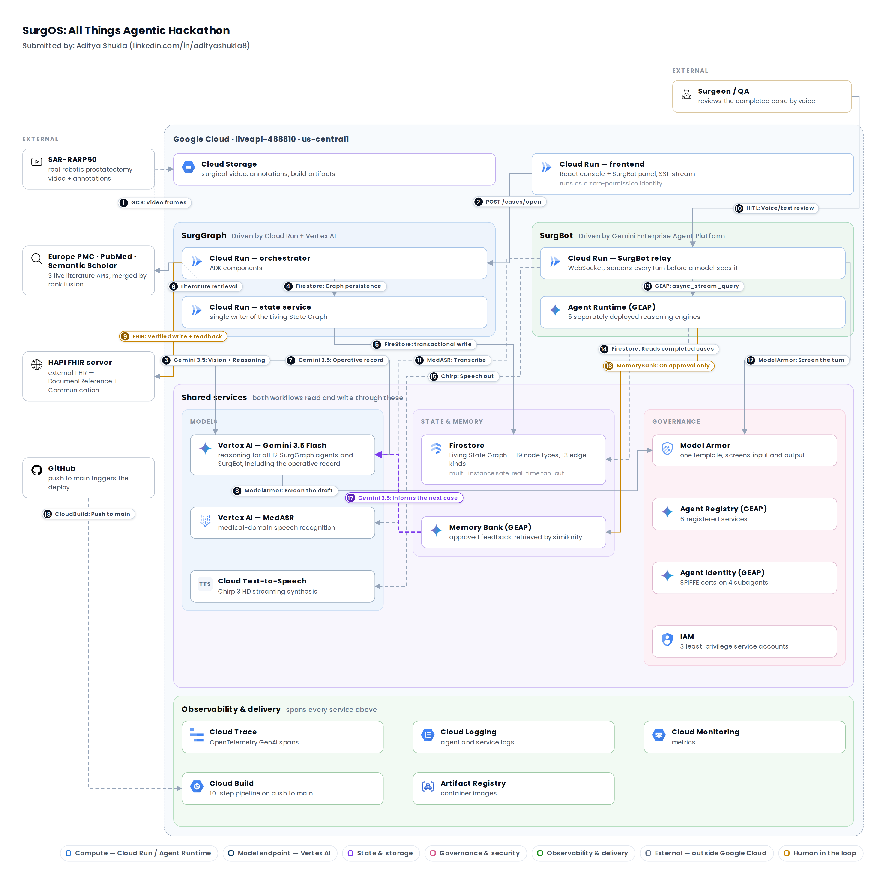

<div align="center">

# SurgOS: Autonomous, Continuously Improving Surgical Safety System<br>[TaskMaster + Collaborative Assistant on GEAP]

**SurgOS watches a robotic surgery, catches technique errors as they happen, reasons about where they lead using live published literature, and writes a real clinical record - then reviews the case with the surgeon by voice/text and carries their feedback to improve next sessions.**

[](https://cloud.google.com/vertex-ai)
[](https://developers.google.com/health-ai-developer-foundations)
[](https://google.github.io/adk-docs/)
[](https://cloud.google.com/vertex-ai)
[](https://cloud.google.com/run)
[](https://cloud.google.com/firestore)
[](https://cloud.google.com/security-command-center/docs/model-armor-overview)
[](https://hapi.fhir.org)
[](https://www.python.org/)
[](#9-spin-up-instructions)

**Built for:** [All Things Agentic Hackathon](https://allthingsagentichackathon.devpost.com/) · Taskmaster track + Collaborative Assistant deployed on GEAP

**Live Demo:** [SurgOS Demo](https://vimeo.com/1222691662?fl=pl&fe=sh)

**Live Deployment:** https://surggraph-frontend-518946358970.us-central1.run.app

</div>

---

## Table of Contents

1. [The Problem](#1-the-problem)
2. [The Solution: What SurgOS Does](#2-the-solution-what-surgos-does)
3. [Architecture](#3-architecture)
4. [Breaking it Down: How SurgOS Works](#4-breaking-it-down-how-surgos-works)
5. [State Management: the Living Graph](#5-state-management-the-living-graph)
6. [How It Was Built](#6-how-it-was-built)
7. [Google Cloud Services](#7-google-cloud-services)
8. [Data Sources](#8-data-sources)
9. [Spin-Up Instructions](#9-spin-up-instructions)
10. [Project Structure](#10-project-structure)
11. [Accomplishments](#11-accomplishments)
12. [What's Next](#12-whats-next)
13. [Built With](#13-built-with)
14. [Disclaimer](#14-disclaimer)
15. [Attributions](#15-attributions)

---

## 1. The Problem

**Surgical errors compound into patient complications.**

**Complications impact patient outcomes & health systems** - _some complications costing up to $166,000 per patient!_

**Avg. surgical documentation time is 14 days after the actual case.**

**And feedback from one case rarely reaches the next -** complications from one case can happen in the next case too.

> _**Real example**: In a [case published in 2023](https://pmc.ncbi.nlm.nih.gov/articles/PMC10436752/), a stitching needle was lost inside a patient during a robotic prostate operation - it slipped while being withdrawn through a port, and nobody knew until the count came up short. It took a 10-minute search to find, and X-rays miss needles this size about **70% of the time**. Leaving one behind is what hospitals call a *never event*: roughly **1 in 10,000 operations**, at an average cost of **about $166,000** each time._

>**Every one of these is a gap in what the OR keeps track of - and that is what SurgOS closes.** 
  - It maintains a live record of every instrument and action 
  - Flags a technique error in the window it happens
  - Drafts the operative note in minutes
  - Carries the surgeon's correction into the next case.

### The evidence

| The problem | Impact |
|---|---|
| **26.4% of patients** who have something go wrong during an operation go on to develop a serious complication - against 12% of patients where nothing does. One missed step rarely stays contained. <br>[Gawria et al., 2023 · PMC10095268](https://pmc.ncbi.nlm.nih.gov/articles/PMC10095268/) | Longer stays, repeat surgery |
| **15% of surgery patients** develop at least one complication. Not an edge case - the baseline risk of operating. <br>[Tevis et al., 2016 · PMC6214627](https://pmc.ncbi.nlm.nih.gov/articles/PMC6214627/) | Events like needle lost can cost upto ~$166,000 per incident |
| **374 hours - over 15 days** is how long the average operating note takes to be written up and signed off. The record everyone else relies on is routinely two weeks stale. <br>[Laflamme et al., 2005 · PMC1560865](https://pmc.ncbi.nlm.nih.gov/articles/PMC1560865/) | Hours of delay, Follow-up care flies blind |
| **Only 28% of feedback programmes** for clinicians improve care by 10% or more; across 98 trials, typical gain was just 4.4 points. _**What one team learns rarely reaches the next.**_ <br>[Ivers et al., 2014 · PMC4238192](https://pmc.ncbi.nlm.nih.gov/articles/PMC4238192/) | Same mistake, next patient |

>**The operating room generates the richest signals in medicine and most of it is never fully leveraged - in the moment, in the record, and in the loop back to the next case.**

---

## 2. The Solution: What SurgOS Does

- **SurgOS watches a surgery as it happens**
- **Catches mistakes in the moment**
- **Works out where they lead, files a real medical record**
- **Reviews the case with the surgeon and carries what they say into every case after it.**

| Feature | Impact |
|---|---|
| **Watches the surgery** - Gemini 3.5 vision over 5-second windows | A continuous log: running picture of the case builds itself. Every instrument move, contact with anatomy and step change, logged as it happens. Nobody has to watch or remember. |
| **Detects mistakes on its own** - 3 agents (time, position/space, procedure) vote; a non-AI scoring step decides | Mistakes surface **the instant they happen**, not in a review weeks later. No single AI agent can raise one alone. |
| **Works out what complication can each mistake could lead to** - reasoning grounded in medical papers pulled live | Tells the surgeon **where this mistake is likely to lead for *this* patient** - their build, overall health, anatomy - backed by real papers, not a generic risk score. |
| **Suggests a fix** - chosen from a pre-approved list of actions, never free-written | A specific next step to avoid the complication. When it isn't confident, **it says so** instead of guessing. |
| **Checks whether the recommended fix was followed** - rules-based check first, Gemini only when unclear | **Silent when the surgeon follows the plan.** It speaks up only when the case actually goes off it - no alarm fatigue. |
| **Writes the full operating note in minutes** - drafted from the case as it was observed | **374 hours down to ~4 minutes.** Accurate because it's built from what was seen, not recalled two weeks later - and the team gets it while it still matters. |
| **Files alerts and the note to a real medical record system** - FHIR | Findings land **where the care team already looks**. Every write is read back to confirm it arrived. |
| **Refuses to file anything it can't back up** - a rules-based gate, not an AI one | A surgeon can trust an alert because the system **can't raise one without evidence**. Blocked writes stay on record, so what *didn't* go out is visible too. |
| **Screens everything going in and out** - Model Armor, one policy, both directions | A hostile or malformed instruction **never reaches the model**, and nothing unsafe reaches the record filed under a surgeon's name. |
| **Keeps a human on every external write** - 3 approval gates | **Nothing reaches a patient's chart on its own.** The system does the work and waits to be told yes. |
| **Lets surgeons and safety teams review cases by voice** - SurgBot's 6-phase review | Review in **minutes, hands-free** - one case or all of them. Across **103 cases** it surfaced "out of view" (174) and "needle handling" (117) as the top failure modes. |
| **Learns from what the surgeon says** - approved feedback routed to the agent that needs it | Feedback given **once** shapes every case after it: better detection, fewer repeat mistakes. |

---

## 3. Architecture

[](docs/architecture/surgos-architecture-diagram-4k.png)

> **[Open the full-resolution diagram →](docs/architecture/surgos-architecture-full-4k.png)**

> **Decoupled Autonomous & Feedback Workflow with HITL gates**

- The verification gate, vote aggregation, severity scoring, literature ranking, alert routing, the first divergence check and the whole perception change-diff layer. 
- **Safety _decisions_ come from steps an AI model isn't allowed to touch -** maintaining Human in The Loop and gated workflow.
- **Model choice is per-step, not global.** Gemini 3.5 Flash for reasoning and vision, with native structured output where a step's result has to match a schema. 
- **MedASR** for speech, where the domain genuinely changes the answer: 5.2–6.9% error rate on medical dictation, against Whisper large-v3's 12.5–28.2%.
- **Decoupled design** 
  - **SurgGraph service** focuses on error & complication workflow
  - The **FireStore state service** serves as _multi-tenant, cross-case graph storage accessible to both SurgGraph, SurgBot_ & any downstream future analytics - not limited to SurgGraph agents.
  - **The SurgBot** can read the graph and **cannot change it**.

### Error handling

- **Fail-closed on safety, fail-soft on enrichment.** Two criticality classes, opposite defaults. Anything gating an *external* action blocks when uncertain; anything *enriching reasoning* degrades to empty rather than taking a live case down with it.
- **Failures are isolated, never cascaded.** No single agent's failure can fail the case. Independent stages are independently guarded, so one failing never blocks another or blocks case close.
- **In-flight work is drained, not cancelled.** Event-driven handlers get a bounded budget to finish before a case closes, so reasoning triggered by the last event of a case isn't killed mid-flight.
- **Every degradation is a typed record in shared state, not a log line.** A blocked write, a low-confidence escalation, a missing evidence source, a partial sample — each is a first-class node any agent or human reviewer can see. **No path in this system fabricates a plausible-looking result:** a failure state must look like a failure, never a quieter version of success.

### Security

- **Model Armor both directions, one policy.** 
  - `sanitize_user_prompt` on the surgeon's turn **before Gemini sees it**
  - `sanitize_model_response` on generated content **before a human sees it**. 
- **Human input is treated as untrusted, exactly like model output.** An edited note is re-screened and re-checked before filing. Feedback that fails screening stays in Firestore with `memory_written=false` and never reaches Memory Bank.
- **Three service accounts, disjoint powers.** 
  - `surggraph-cicd` deploys but can't read data. 
  - `surggraph-runtime` reads data but can't deploy. 
  - The frontend service runs with **zero roles**. 

- >*A compromised agent can't deploy, a compromised build can't read data, the frontend can do neither.* 

- **Agent Identity (SPIFFE), no long-lived keys**.
- **CORS is explicit per service**, never a wildcard. 

### Observability & Monitoring

- **OpenTelemetry spans to Cloud Trace** across every service - one at case open, one per sweep, one per triggered agent linked to what triggered it, and one per model call.
- **Every record carries provenance** - which agent, which tool - enforced at the schema level, so any claim traces back to the call that made it.
- **Test driven development: 159 tests passing**, plus a graph-chain validator that runs after every change that writes to the graph, because unit tests provably don't catch this class of bug.

---

## 4. Breaking it Down: How SurgOS Works

One system, two workflows, joined by a learning layer.

### 1. SurgGraph - the autonomous workflow

>An event-driven workflow with autonomous routing: **12 ADK agents on Cloud Run + Vertex AI** that watch a case, work out what happens next, and run it start to finish with nobody steering.

- **One trigger, end to end.** A case opens on `POST /cases/open` and runs to a filed medical record with **zero human input**.
- **Watches for change on two channels at once.**
  - *In the video* - `Perception` tracks instruments, anatomy and steps; `Error Detection` (3 sub-agents) votes on whether something went wrong. All 4 run in parallel over 5-second windows.
  - *In the state* - every write publishes to an in-process event bus, so every agent downstream has live case context.
- **Autonomous routing - each stage decides what runs next.** A detected mistake wakes Complication Reasoning → a complication wakes Corrective Replanning → a plan wakes Divergence Detection → a divergence wakes Alert Routing. Nothing is scheduled. A stage fires **only because the case produced the thing it reacts to**.
- **Interacts to real outside systems.** 
  - 3 live medical-literature APIs at reasoning time
  - **Model Armor** screening the draft the moment it's written
  - Real **FHIR writes** to an external record server, each read back to confirm
  - **Firestore** and **Cloud Storage** for state and media.
- **Stops where a human takes over.** It ends with a real external write and a drafted note in an approval queue - the one thing it won't do alone.

### 2. SurgBot - the collaborative feedback workflow

>A **stateful, multi-turn reviewer** that pulls real case context live and remembers the reviewer between sessions 

**5 reasoning engines on the Gemini Enterprise Agent Platform**.

- **Reviews with a surgeon or safety team, by voice or text.** One case or all of them. SurgBot only *reads* what SurgGraph produced; it never touches the pipeline.
- **Stateful, multi-turn dialogue.** A 6-phase review - `case briefing, walkthrough, mistake review, fix-and-divergence review, written summary, cross-session patterns` - held in one continuous **Agent Runtime managed session**. Not a rigid script: the reviewer can skip ahead or double back and the conversation keeps its place.
- **Real-time context retrieval.** 9 tools pull exactly the context each turn needs - live case state, the full chain behind one mistake including the papers retrieved at the time, and aggregate stats across every case. It **says when a sample is partial** rather than implying full coverage.
- **Asks, then captures.** Every finding ends with an explicit ask - agree / disagree / unsure - plus free-text notes, recorded as they happen.
- **Adapts in the session, personalises across them.** Ask for bulleted answers and the **very next reply is bulleted**. Come back later and **Memory Bank** greets you with your own patterns. With no history yet, it says so - it never invents one.

**How an organisation discovers, audits, trusts and scales these agents**

- **Discovery** - all **6 agentic services** registered in **Agent Registry**, found and inspected through the console, not this repo.
- **Orchestration at scale** - the root agent dispatches to 4 specialists via `async_stream_query`. Each is separately deployed and independently redeployable; changing one doesn't touch the others. Running against **103 real cases**.
- **Long-term state, three tiers** - 
  - **Agent Runtime sessions** within a review
  - **Firestore** as the system of record
  - **Memory Bank** for durable cross-session facts, written only on approval.
- **Runtime OTel observability** - every tool call is shown live, naming the real agent, model and API behind it. **OpenTelemetry spans to Cloud Trace** across every service, and every record carries provenance back to the call that made it.
- **Security** - 
  - **Model Armor** both directions, fail-closed - **Agent Identity** (SPIFFE) on the subagents, no long-lived keys
  - Deploy rights and data rights held by different identities, and the frontend holds **zero roles**
  - An **edited document is re-screened** and re-checked by **Model Armor** before filing, _because human input is treated as untrusted too_.

### 3. The learning layer - what closes the circuit

>Memory that outlives the session and crosses into the other workflow

What a surgeon says in a review becomes context the autonomous pipeline reads on the next case.

- **Approval-gated.** Nothing becomes durable knowledge until the surgeon approves the review. **The approval is the write.**
- **Classified, then routed.** Feedback goes to the agent responsible for it - literature feedback to the literature agent, and so on.
- **Screened first.** Model Armor checks human text before it can ever become part of a prompt.
- **Stored twice, on purpose.** Firestore as the record; Memory Bank as the index, scoped so an agent only sees feedback meant for it.
- **Advisory only, by design.** Agents are forbidden from suppressing findings, and **unable to touch the verification gate** - a surgeon's opinion can shape the reasoning, never unlock a write the evidence doesn't support.

This third piece is why SurgOS is a loop and not a detector.

---

## 5. State Management: the Living Graph

**A continuous context state lives in one shared graph in Firestore**, written through a single API.

- **20 node types, 13 edge kinds.** Every agent's output is a record other agents can read, never a private variable.
- **One Firestore document per case**, with a counter each write increments inside a transaction - so two agents writing at once queue instead of clobbering each other. One isolated graph per case.
- **Live updates** via Firestore's `on_snapshot`, scoped to everything newer than what the client already has. The console streams over SSE.
- **IDs come from one module**, never hand-written by an agent - which is what stops links breaking when two agents disagree on a naming convention.

One graph, three jobs:

- **Live case context** - each agent gets a slice assembled before the call, so the same graph always produces the same slice.
- **The operating note** - already written by the time the case ends. The record is a by-product of reasoning that already happened, not a separate writing job.
- **SurgBot's history** - a reviewer can walk a case that finished days ago, or aggregate across a hundred.

---

## 6. How It Was Built

Two workflows, two runtimes. The split is a measured decision, not a limitation.

**SurgGraph - Cloud Run + Vertex AI.** 12 ADK agents, one background task per case. Four reasons:

- High call volume per 5-second window - 100s of graph nodes/state written every 1 minute of video analysis
- The in-process event bus breaks the moment a case's agents split across processes.

**SurgBot - Gemini Enterprise Agent Platform.** 5 separately deployed reasoning engines on Agent Runtime, fronted by a Cloud Run WebSocket relay:

- Low call volume, one turn every few seconds.
- Managed sessions with real `session_id` continuity.
- Memory Bank as the native home of the learning layer.
- Agent Identity works here, because these subagents make no outbound Google Cloud calls.


### Orchestration
#### SurgGraph Orchestration
| Component | Layer | What it does |
|---|---|---|
| **Perception** | SurgGraph | One Gemini 3.5 vision call per 5-second window over locally extracted frames. Detects entities/relation/activity. A steady state emits nothing and downstream agents never fire on noise. |
| **Error Detection - Temporal** | SurgGraph | Reasons over motion across the window: hesitation, retries, multi-attempt patterns. One of three independent perspectives on the same frames. |
| **Error Detection - Spatial** | SurgGraph | Judges instrument and anatomical positioning at native resolution - where things sit relative to each other, and what left the field of view. |
| **Error Detection - Procedural** | SurgGraph | Compares observed technique against expected protocol for the current step, against the six OCHRA-derived error categories. |
| **Weighted Aggregation + Severity** | SurgGraph | **Deterministic Python, no model.** Takes the three roles' opinions, compiles agreement and a composite score above threshold to raise an error, then scores severity. **Consensus arithmetic in surgical space is not a thing AI should be doing.** |
| **Complication Reasoning** | SurgGraph | Event-driven off error nodes above a severity threshold. **Formulates a literature query from live case context**, reasons over the retrieved abstracts, and writes complications linked back to their evidence - with rationale specific to *this* patient's risk profile. |
| **Literature Retrieval** | SurgGraph | **Tool**: Three live APIs queried in parallel - _Europe PMC, PubMed E-utilities, Semantic Scholar_ - merged by reciprocal rank fusion with DOI dedup. **Every citation traces to a real query.** |
| **Corrective Replanning** | SurgGraph | Event-driven off complications. Selects from a bounded, OCHRA's own normal-technique indicators, or escalates when nothing fits. *Never invents a novel procedure.* |
| **Proposal Acknowledgment** | SurgGraph · HITL | The surgeon acknowledges or dismisses a live proposal. Acknowledging keeps monitoring as advisory; dismissing stops it. The decision is durable graph state, so it survives a restart. |
| **Divergence Detection** | SurgGraph | Polls only while a proposal is actually live. Deterministic graph check first - **did the same error fire again** - with LLM reasoning only when that's ambiguous. Writes nothing when the plan is followed. |
| **Alert Routing** | SurgGraph | **Deterministic.** Writes the pending external action to the graph **before** sending it, calls the gate synchronously, and executes only on a pass - so a blocked alert leaves a visible record of what didn't go out. |
| **Verification Gate** | SurgGraph | Eleven structural checks over the graph, fail-closed. Read-only: **it cannot write the action it approves, only return pass or block**. |
| **Documentation** | SurgGraph | Drafts the operative record from the case graph, so the *note is assembled from what was observed rather than recalled. Screened by Model Armor* the moment it's drafted, before a surgeon sees an Approve button. |
| **Operative Record Approval** | SurgGraph · HITL | Approve, edit or reject. An edit is re-screened by Model Armor and re-checked by the gate before filing - human input is treated as untrusted, exactly like model output. |
| **FHIR Write Executors** | SurgGraph · Tool | Thin adapters, not reasoning agents. *Real `Communication` and `DocumentReference` writes to a live HAPI FHIR server*, each read back to confirm it landed. |

#### SurgBot Orchestration

| Component | Layer | What it does |
|---|---|---|
| **SurgBot Orchestrator** | SurgBot | **The collaborative assistant allwing surgeons to review cases**. Nine tools, driving a six-phase review - case framing, phase walkthrough, error review, proposal/divergence review, synthesis, cross-session patterns - plus standing cross-case queries. |
| **Error Chain Reviewer** | SurgBot | **Explains** the mechanism behind a flagged error **and probes whether it holds up clinically**, working from the same evidence chain the pipeline built. Separately deployed with Agent Identity. |
| **Synthesis** | SurgBot | **Drafts the case review document from what the surgeon actually said** - `agreements`, `disagreements` and `coaching notes`, captured as they happened. |
| **Pattern Insight** | SurgBot | **Surfaces patterns** across a reviewer's previous sessions **from Memory Bank**. Reports "no history yet" honestly rather than inventing one. |
| **Feedback Router** | SurgBot | Classifies free-text surgeon feedback as a standing directive or a case-grounded observation, and routes it to the pipeline agent it belongs to. |
| **Review Approval** | SurgBot · HITL | Approving the review is what turns captured feedback into **durable knowledge**. *Nothing said in a session reaches the pipeline until the surgeon signs off*. |
| **MedASR / Chirp 3 HD** | SurgBot · Tool | Self-deployed **medical-domain speech recognition** in, streaming HD synthesis out. Disclosed in the transcript as plain API calls. |

---

## 7. Google Cloud Services

**AI models**
- **Gemini 3.5 Flash** - Vertex AI, `global` endpoint. Vision and reasoning for all 12 SurgGraph agents and all 5 SurgBot agents.
- **MedASR** - self-deployed Conformer ASR (Health AI Developer Foundations). Medical-domain speech-to-text for SurgBot's voice turns.
- **Chirp 3 HD** - Cloud Text-to-Speech. Streams SurgBot's spoken replies sentence by sentence.

**Agent platform**
- **Vertex AI** - model serving and endpoints for every Gemini and MedASR call.
- **Gemini Enterprise Agent Platform**
  - **Agent Runtime** - 5 separately deployed reasoning engines hosting SurgBot.
  - **Agent Registry** - 6 registered services across both runtimes.
  - **Agent Identity** - SPIFFE-based identity on the tool-free subagents.
  - **Memory Bank** - managed cross-session memory; the substrate of the learning layer.
  - **Model Armor** - one template, enforced on both inbound user turns and outbound generated content.

**Infrastructure**
- **Cloud Run** - 4 services: state, orchestrator, SurgBot relay, frontend.
- **Cloud Build** - CI/CD; builds and deploys all four on push to main.
- **Firestore** - the Living Graph. Multi-tenant, per-case isolated, transactional, with native real-time fan-out.
- **Cloud Storage** - surgical video, build artifacts.
- **Artifact Registry** - container images.

**Observability**
- **Cloud Trace** - OpenTelemetry GenAI spans across every service.
- **Cloud Logging + Cloud Monitoring** - agent and service logs, metrics.

---

## 8. Data Sources

- **SAR-RARP50** - Surgical video dataset for the surgical video
- **SEDMamba** - per-frame error ground truth, used **only for offline scoring**, no data-leakage to any agent at run time.
- **OCHRA** - the published error taxonomy behind the six categories; the fix library inverts its own good-technique indicators, so a suggested fix is never novel clinical advice.
- **Europe PMC · PubMed E-utilities · Semantic Scholar** - three live literature APIs queried at reasoning time and merged by rank fusion; no static corpus, no templated query.
- **HAPI FHIR** (public server) - the external medical record destination, with every write read back to confirm.
- **Synthetic patient profile and vitals** - modeled on real physiology.

---

## 9. Spin-Up Instructions

### Prerequisites

- **Python 3.12** (`>=3.12,<3.13`) and [`uv`](https://docs.astral.sh/uv/)
- **Node.js 20+** and npm
- A **Google Cloud project** with billing enabled
- `gcloud` CLI, authenticated: `gcloud auth login && gcloud auth application-default login`

### Step 1 - Clone and install

```bash
git clone https://github.com/adityashukla8/surggraph.git
cd surggraph

uv sync                              # Python dependencies
cd ui/frontend && npm ci && cd ../..  # frontend dependencies
```

### Step 2 - Enable Google Cloud APIs

```bash
export PROJECT_ID=your-project-id
gcloud config set project $PROJECT_ID

gcloud services enable \
  aiplatform.googleapis.com \
  run.googleapis.com \
  cloudbuild.googleapis.com \
  artifactregistry.googleapis.com \
  firestore.googleapis.com \
  storage.googleapis.com \
  modelarmor.googleapis.com \
  speech.googleapis.com \
  texttospeech.googleapis.com \
  cloudtrace.googleapis.com
```

### Step 3 - Create the backing resources

```bash
# Firestore (native mode) - the Living State Graph
gcloud firestore databases create --location=us-central1

# Cloud Storage - source video, annotations, build artifacts
gcloud storage buckets create gs://surggraph-cases-$PROJECT_ID --location=us-central1

# Model Armor template - screens both inbound turns and outbound generated content
gcloud model-armor templates create surggraph-fhir-outbound --location=us-central1
```

### Step 4 - Download the dataset

The video and annotations are **not** in this repository - they are ~890MB of licensed research media. **See [`data/README.md`](data/README.md) for the full walkthrough**; UCL's repository sits behind a WAF challenge that blocks scripted downloads, so these must be fetched through a browser.

```
data/video/video_01/          # SAR-RARP50 video file
data/annotations/video_01/    # action_discrete.txt, segmentation/, error_annotation.pkl
```

Then verify what you have:

```bash
uv run scripts/validate_downloaded_data.py video_01
```

### Step 5 - Configure the environment

```bash
cp .env.example .env
```

Key variables:

| Variable | Used by | Purpose |
|---|---|---|
| `SURGGRAPH_PROJECT_ID` | `tools/gemini_model.py` | GCP project for Vertex AI |
| `SURGGRAPH_REGION` | everywhere | Default `us-central1` |
| `GEMINI_MODEL` | `tools/gemini_model.py` | Default `gemini-3.5-flash` |
| `GEMINI_LOCATION` | `tools/gemini_model.py` | Default `global` - the model 404s on every tested regional endpoint |
| `GOOGLE_GENAI_USE_VERTEXAI` | `google-genai` | `true` - route through Vertex AI, not the Gemini API |
| `FIRESTORE_DATABASE` | both services | Named Firestore database, default `(default)` |
| `SURGGRAPH_GCS_BUCKET` | state service | Video and annotation storage |
| `FHIR_BASE_URL` | `tools/fhir_write.py`, `tools/fhir_alert.py` | Default `https://hapi.fhir.org/baseR4` |
| `STATE_SERVICE_URL` | `tools/state_tools.py` | If unset, agents fall back to local JSONL (scripts/tests only) |
| `SURGGRAPH_MODEL_ARMOR_TEMPLATE_ID` | `tools/model_armor.py` | Model Armor template ID |
| `MEDASR_ENDPOINT_ID` | `agents/surgbot/speech.py` | Vertex AI endpoint for medical speech-to-text |
| `SURGBOT_ROOT_AGENT_RESOURCE` | `services/surgbot_service` | Deployed Agent Runtime reasoning engine |
| `SURGGRAPH_FEEDBACK_KB_ENGINE` | `tools/feedback_kb.py` | Memory Bank engine backing the learning layer |
| `SURGGRAPH_SWEEP_START_S` / `_END_S` | `tools/video_utils.py` | Optional dev bound on how much video a case sweeps |
| `SURGGRAPH_ENABLE_CLOUD_TELEMETRY` | `tools/observability.py` | OpenTelemetry export to Cloud Trace |
| `VITE_STATE_SERVICE_URL` / `VITE_ORCHESTRATOR_URL` / `VITE_SURGBOT_SERVICE_URL` | frontend | Backend URLs, inlined at **build** time |

### Step 6 - Deploy the model endpoints

MedASR is self-deployed from Model Garden (`n1-standard-8` + 1x NVIDIA T4). It is GPU-backed and billed hourly while running. Deploy it, then set `MEDASR_ENDPOINT_ID` in `.env`.

### Step 7 - Run locally

Four processes, four ports:

```bash
# terminal 1 - state service (single writer of the Living Graph)
uv run uvicorn services.state_service.main:app --host 127.0.0.1 --port 8080

# terminal 2 - orchestrator (runs the whole SurgGraph pipeline)
uv run uvicorn services.orchestrator_service.main:app --host 127.0.0.1 --port 8090

# terminal 3 - SurgBot relay (WebSocket, voice + text)
uv run uvicorn services.surgbot_service.main:app --host 127.0.0.1 --port 8091

# terminal 4 - frontend
cd ui/frontend && npm run dev
```

Open **http://127.0.0.1:5173**, press play on the demo video, and watch the graph build live.

### Step 8 - Deploy SurgBot to Agent Runtime

The five SurgBot reasoning engines are deployed separately from the Cloud Run services:

```bash
uv run scripts/deploy_surgbot_subagents.py   # the 4 subagents, with Agent Identity
uv run scripts/deploy_surgbot_agent.py       # the root agent
uv run scripts/register_surgbot_agents.py    # register all of them in Agent Registry
```

> A code change inside `agents/surgbot/` does **nothing** in production until the agent is redeployed - the fix landing in git is not the fix landing in the running system. Both deploy scripts pin `google-adk` and `google-genai` explicitly, after an unpinned transitive upgrade broke a redeploy.

### Step 9 - Deploy to Google Cloud

One Cloud Build pipeline builds and deploys all four Cloud Run services:

```bash
gcloud builds submit --config cloudbuild.yaml
```

Or wire it to a GitHub trigger for deploy-on-push-to-main.


### Step 10 - Verify

```bash
uv run pytest tests/ -q                          # 159 tests
cd ui/frontend && npx tsc -b                     # NOT --noEmit (see below)
uv run scripts/validate_graph_chain.py <case_id> # dangling / orphans / reachability
```

---

## 10. Project Structure

```
surggraph/
├── agents/                      # every agent, one module each
│   ├── orchestrator/            #   opens a case, wires and drives the pipeline
│   ├── perception/              #   vision sweep + deterministic change-diff layer
│   ├── error_detection/         #   3 role subagents, aggregation, severity, knowledge base
│   ├── complication_reasoning/  #   error → patient-specific complication
│   ├── literature_retrieval/    #   3-API fan-out + reciprocal rank fusion
│   ├── corrective_replanning/   #   bounded action library selection
│   ├── divergence_detection/    #   actual vs. proposed trajectory
│   ├── alert_routing/           #   intent-before-write, gate-checked delivery
│   ├── verification_gate/       #   fail-closed, read-only by import, no LLM
│   ├── documentation/           #   operative record draft
│   ├── hitl/                    #   acknowledgment + approval state transitions
│   └── surgbot/                 #   root agent, 4 subagents, tools, speech, Memory Bank
│
├── services/                    # three FastAPI apps, one shared image
│   ├── state_service/           #   single writer of the Living Graph + SSE fan-out
│   ├── orchestrator_service/    #   POST /cases/open, HITL endpoints
│   └── surgbot_service/         #   WebSocket relay: STT → agent → TTS
│
├── state/                       # the state layer itself
│   ├── schema.py                #   20 node types, 13 edge kinds, provenance
│   ├── node_ids.py              #   the single source of every node/edge ID
│   └── event_bus.py             #   in-process pub/sub driving the event-driven agents
│
├── tools/                       # capabilities, not agents
│   ├── gemini_model.py          #   global-endpoint Gemini wrapper
│   ├── state_tools.py           #   the single graph write path
│   ├── context_slice.py         #   deterministic per-agent graph slicing
│   ├── model_armor.py           #   inbound + outbound screening
│   ├── fhir_write.py / fhir_alert.py   # real external writes, readback-verified
│   ├── europepmc_rag.py / pubmed_eutils.py / semantic_scholar_api.py
│   ├── feedback_kb.py           #   the learning layer's retrieval side
│   └── memory_bank.py           #   GEAP Memory Bank client
│
├── ui/frontend/                 # React + Vite + TypeScript
│   └── src/
│       ├── pages/home/          #   the landing site
│       ├── graph/               #   live ReactFlow graph over SSE
│       ├── surgbot/             #   voice panel, WebSocket client
│       └── video/               #   player + case trigger
│
├── data/                        # datasets (media gitignored - see data/README.md)
├── docs/                        # architecture diagram, internals, QA log, validation
├── scripts/                     # deploy, validate, benchmark, E2E test drivers
├── tests/                       # 159 tests, real-data assertions throughout
├── cloudbuild.yaml              # CI/CD: 4 Cloud Run services on push to main
└── Dockerfile                   # one shared backend image, SERVICE_MODULE selects the app
```

---

## 11. Accomplishments

- **A complete autonomous chain from raw surgical video to a real external clinical write**, readback-verified against a live FHIR server. Not a webhook, not a simulated EHR - a real `DocumentReference` and a real `Communication` resource that can be fetched back by ID.
- **A learning loop that is closed and proven.** All four consuming agents show real Memory Bank retrievals in deployed Cloud Run logs, with real cache behavior (6.76s cold → 0.19s warm). Feedback given in one session demonstrably reaches the next case.
- **34% end-to-end wall-time reduction** on the instrumented comparison window (328.8s → 217.8s), with zero drain-budget cancellations and the graph chain independently re-validated as fully connected on every run.
- **A fail-closed gate that has visibly blocked writes.** `verification_block` is a first-class node type, so a refusal is as inspectable as an approval - which is the property that makes the system auditable.
- **A medical-domain speech model where it actually changes the answer** - MedASR transcribes clinical dictation at a 5.2% word error rate against Whisper large-v3's 28.2% on Google's multi-specialty test set.
- **159 tests passing, four Cloud Run services deployed by Cloud Build on push to main, six services in Agent Registry**, and OpenTelemetry spans across every one of them.
---

## 12. What's Next

- **Re-tune the detection threshold** to perform best-performing threshold for the case-specific workflow.
- **Generalize beyond RARP** - the error taxonomy, corrective library and phase priors are procedure-specific by construction; multi-procedure support is the real test of the architecture.
- **Real EHR integration** beyond a public test FHIR server, and real intraoperative telemetry in place of the synthetic vitals stream.

---

## 13. Built With

`google-adk` · `gemini-3.5-flash` · `vertex-ai` · `medasr` · `chirp-3-hd` · `gemini-enterprise-agent-platform` · `agent-runtime` · `agent-registry` · `agent-identity` · `memory-bank` · `model-armor` · `cloud-run` · `cloud-build` · `firestore` · `cloud-storage` · `artifact-registry` · `cloud-trace` · `opentelemetry` · `python` · `fastapi` · `server-sent-events` · `websockets` · `pydantic` · `opencv` · `react` · `typescript` · `vite` · `reactflow` · `hapi-fhir` · `europe-pmc` · `pubmed` · `semantic-scholar`

---

## 14. Disclaimer

> ### This is a hackathon project. It is not a medical device.
>
> **SurgOS has not been clinically tested, clinically validated, reviewed by a practising surgeon, or evaluated by any regulatory body.** It is a research and demonstration system built for the All Things Agentic Hackathon, and it must not be used to inform any real clinical decision, for any real patient, under any circumstances.
>

---

## 15. Attributions

- **CARES** - the zero-shot multi-agent surgical-error-detection architecture the three-role detection design is modeled on, and the accuracy baseline reported against.
- **OCHRA** (Observational Clinical Human Reliability Analysis) - the error taxonomy behind the six error categories, their indicators, and the derived corrective action library.
- **SAR-RARP50** - Segmentation of Surgical Instrumentation and Action Recognition on Robot-Assisted Radical Prostatectomy Challenge, UCL Research Data Repository.
- **SEDMamba** - the error annotation set for SAR-RARP50, used for offline scoring only.
- The four clinical studies cited in [The Problem](#1-the-problem): Gawria et al. 2023, Tevis et al. 2016, Laflamme et al. 2005, Ivers et al. 2014.
