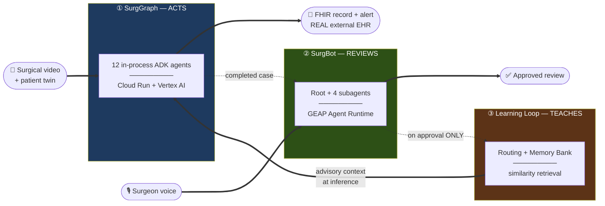
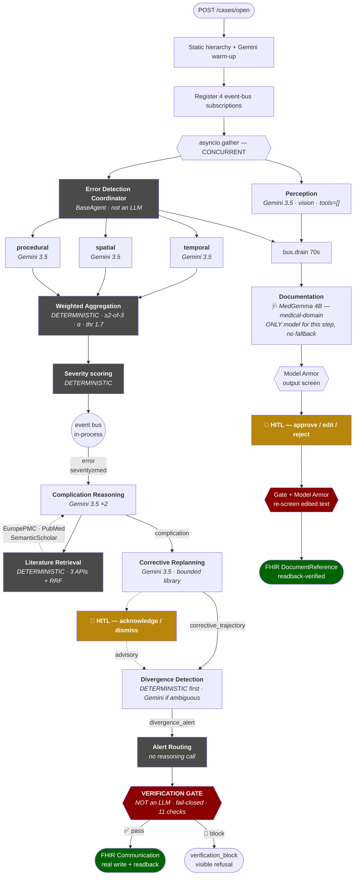
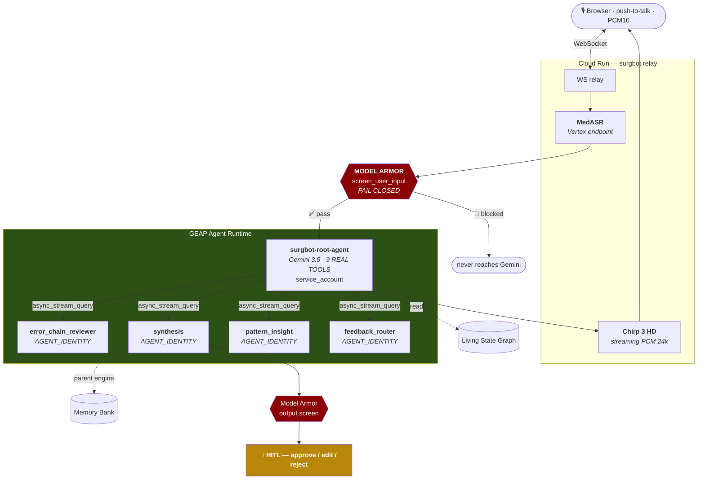
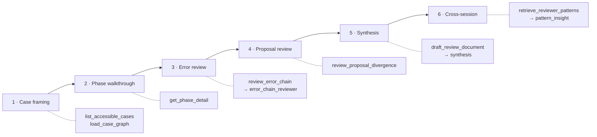
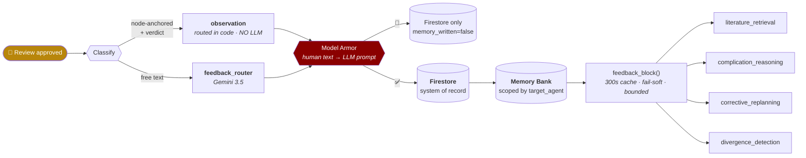
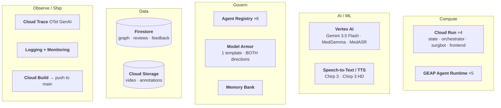
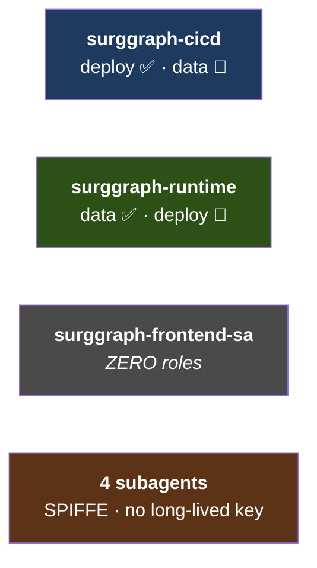
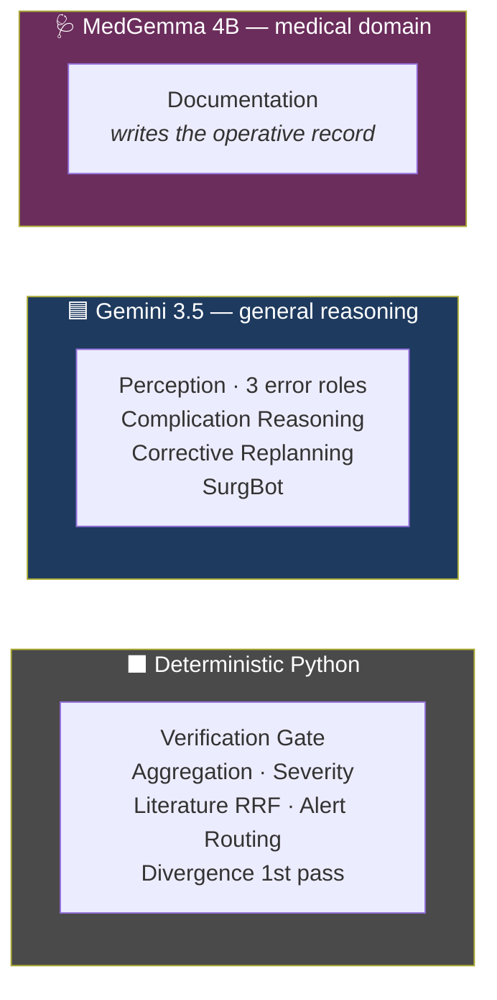

# SurgOS — Visual Workflow Reference

Diagram source for the submission. `liveapi-488810` · `us-central1`

---

## 1. The Loop

---

## 2. ① SurgGraph — Autonomous Pipeline

**Legend** ▪ ⬛ grey = deterministic Python (not an LLM) ▪ 🟥 red = fail-closed gate ▪ 🟨 amber = human ▪ 🟩 green = real external write

| IN | STATE | OUT |
|---|---|---|
| SAR-RARP50 video · opaque phase IDs · synthetic patient twin | Living State Graph — 19 node types, 13 edge kinds, Firestore transactions, SSE fan-out | FHIR `DocumentReference` + `Communication` → real HAPI server |

> ⚠️ **12 agents run.** Anticipation · Scene Graph Builder · Benchmark exist but are **not dispatched**.
>
> 🩺 **MedGemma owns the Documentation step.** The operative record — the one artifact that reaches a
> real external EHR — is written by a **medical-domain model**, not a general one. Self-deployed
> `medgemma-4b-it` on an always-warm L4 endpoint. **No Gemini fallback**: a failure surfaces as a real
> failure, because a record whose provenance says *medical model* must not quietly be written by a
> general one. Provenance is recorded on the node (`drafted_by_model`), so the claim is checkable in
> the graph rather than only asserted.
>
> Measured head-to-head on the real production instruction + real case slice, scored on the five
> framing properties this step exists to enforce:
>
> | | latency | schema | framing checks |
> |---|---|---|---|
> | **MedGemma 4B** | **10.65s** | valid | **5/5** |
> | Gemini 3.5 Flash | 17.04s | valid | 5/5 |
>
> Not a quality concession — faster here, same honesty contract.

---

## 3. ② SurgBot — Conversational Review

### 6 phases → tools → subagents

> 🔑 **The inversion:** every other agent is `tools=[]`. SurgBot root is the *only* agent with real tools — a surgeon-driven conversation can't be pre-sliced. Both conventions have tests enforcing them.

---

## 4. ③ Learning Loop

| Routing | → agent | v1 |
|---|---|---|
| `divergence_alert` | divergence_detection | ✅ |
| `complication` | complication_reasoning | ✅ |
| `literature_evidence` | literature_retrieval | ✅ |
| `corrective_trajectory` | corrective_replanning | ✅ |
| `error` | error_detection | ⚠️ stored, not consumed |

**Guardrails** — advisory text only · *"NOT ground truth"* · forbids suppressing findings · **gate untouched** · approval-gated · fail-soft to `""`

---

## 5. Hosting — Why Different Runtimes

```mermaid
flowchart TB
    subgraph CR["☁️ Cloud Run + Vertex AI — SurgGraph"]
        direction TB
        C1["🔁 <b>High call volume</b><br/>tight per-window loops"]
        C2["⚡ <b>In-process event bus</b><br/>splitting breaks the invariant"]
        C3["🎞️ <b>Local frame access</b><br/>cv2 on disk, no GCS fallback"]
        C4["🔒 <b>Agent Identity 401s</b><br/>on outbound GCP API calls"]
    end
    subgraph AR["🤖 GEAP Agent Runtime — SurgBot"]
        direction TB
        A1["💬 <b>Low call volume</b><br/>one turn per few seconds"]
        A2["🔐 <b>Agent Identity works</b><br/>tool-free subagents"]
        A3["🧠 <b>Memory Bank native</b><br/>substrate of Layer 3"]
        A4["🔗 <b>Managed sessions</b><br/>session_id continuity"]
    end
    style CR fill:#1e3a5f,color:#fff
    style AR fill:#2d5016,color:#fff
```

> **Not an inability — a measured choice.** SurgBot *is* on Agent Runtime, proving capability.
> Agent Registry needs neither: **both Cloud Run services are registered.**

---

## 6. GCP Services

### Identity separation

> Compromised agent can't deploy · compromised build can't read data · frontend can do neither.

---

## 7. Deterministic vs LLM

**Model choice is per-step, not global:** general reasoning on Gemini, the medical-writing step on a
medical model, speech on MedASR. Three purpose-built models, each where it's actually the right tool.

> **The rule:** an LLM reasons over evidence. It never does arithmetic, never gates safety, never receives the answer key.

---

## 8. Judging Criteria

| Criterion | % | Evidence |
|---|---|---|
| **Innovation & Utility** | 40 | Autonomous pipeline → **real external EHR write**, readback-verified |
| **Architectural Discipline** | 30 | Deterministic/LLM boundary · 3-way identity split · evidence-based runtime choice · graph state model |
| **Demo & Production Readiness** | 30 | Live chain: detect → cite → gate → FHIR → readback + visible GCP proof |

✅ Gemini 3.5 via Vertex AI ✅ Google ADK ✅ Cloud Run + Firestore + GCS ✅ built in window
**→ Track 1 (Taskmaster).** Track 3 requires Agent Gateway — not implemented.

---

## 9. Disclose

| Limitation | Note |
|---|---|
| ~15.8s/window vs 5s target | **lags real time ~3×** — align homepage copy |
| 7 of 17 complications grounded | improved, not closed |
| Threshold 1.7 never re-tuned | skews false-negative |
| All Cloud Run public | `allUsers` invoker |
| Agent Gateway absent | Track 3 gap |
| Single-video priors | generalization unverified |

**Not a validated clinical model** — a literature-grounded hypothesis generator.

---

## 10. Design Notes

1. **Hero** = §1 loop. Make the ③→① arrow dominant — it's what makes this one system.
2. Colour-code §2 by **deterministic vs LLM** — the differentiator.
3. Draw Model Armor as a **gate**, not a box.
4. Three easy mistakes: showing 15 agents (12 run) · feedback loop as decorative · omitting deterministic parts.
